# Clientes Ligeros con LSTP/Xubuntu

## Introducción

> Los clientes Ligeros son maquinas con arquitectura de red cliente-servidor que
 se sustenta de un servidor central donde se gestiona y almacena el Usuario.

___

 ## Preparativos:

Usaremos 2 MVs, un servidor LTSP (Xubuntu) y un cliente (Ubuntu).

Configurar el servidor LTSP con dos Tarjetas de red una en "Adaptador Puente" y otra en "Red Interna".

Configurar maquina del cliente con una Tarjeta de Red "Interna"
___
## Servidor LTSP:

##### Instalación del SSOO:

Vamos con la instalación, le damos a Instalar Xubuntu
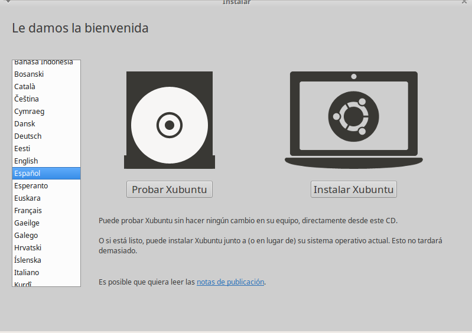
Descargamos las actualizaciones
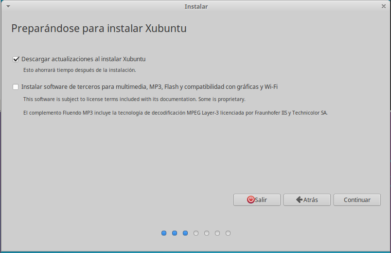
Hacemos click en Instalar ahora
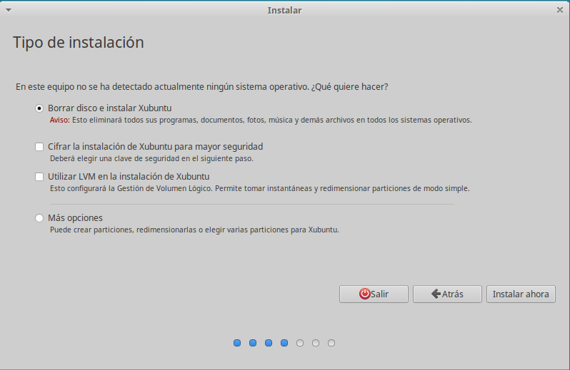
Elegimos la franja horaria donde estasmos
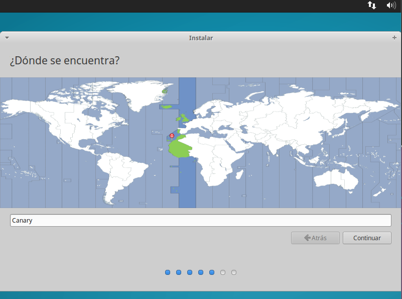
Elegimos el idioma de nuestro teclado
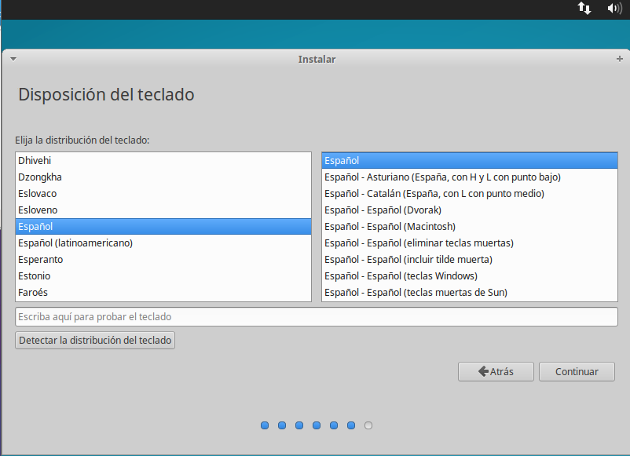
Rellenamos los datos para la instalación
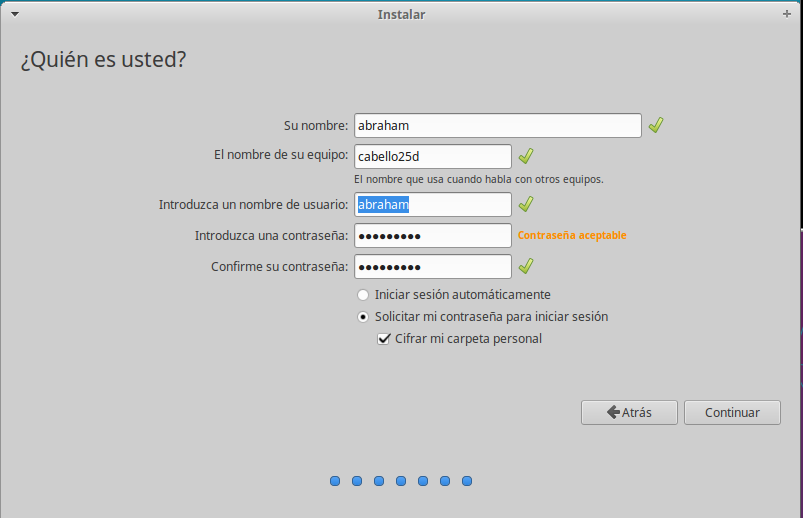
Y esperamos a que termine la instalación
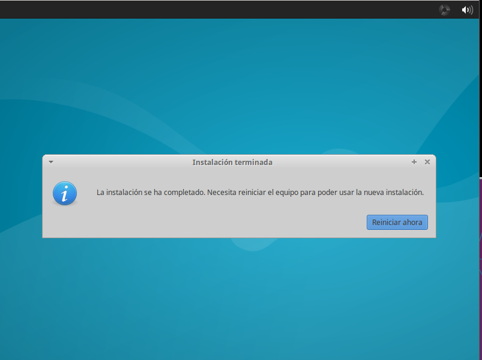

##### Configuración Xubuntu:

Vamos a cambiar la configuración de red, dejando una IP estatica para nuestro servidor.
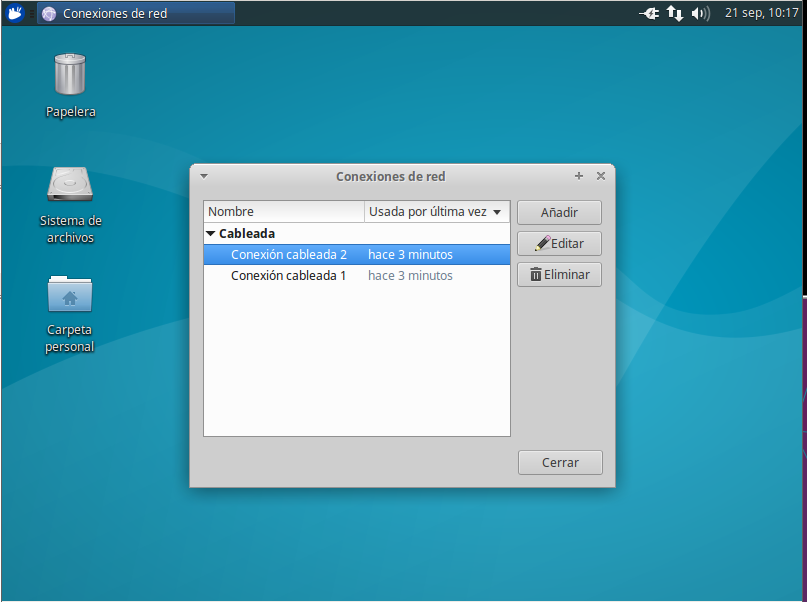
En la Adaptador Puente le ponemos la siguiente configuración:
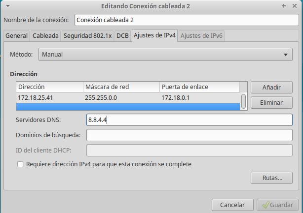
En la Interna dejamos la siguiente configuración:
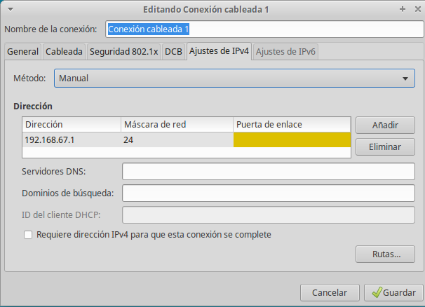
Ejecutamos el siguiente comando para ver que se efectuo el cambio.
> ip a

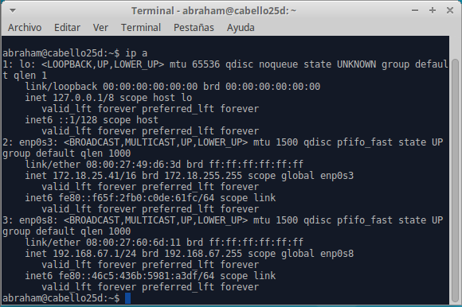
Vamos a configurar el Nombre de Dominio de nuestra maquina, modificamos el archivo "**etc/hostname**".
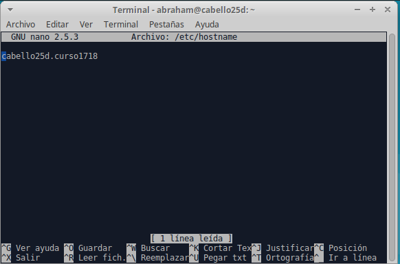
Ahora modificamos el archivo "**etc/host**" para que se muestre el nombre de nuestra maquina al introducir el comando hostname -a.
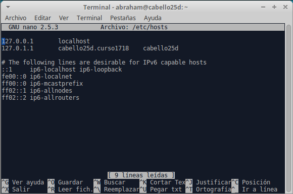

Vamos a poner una contraseña a root para eso usamos el comando "**passwd**"
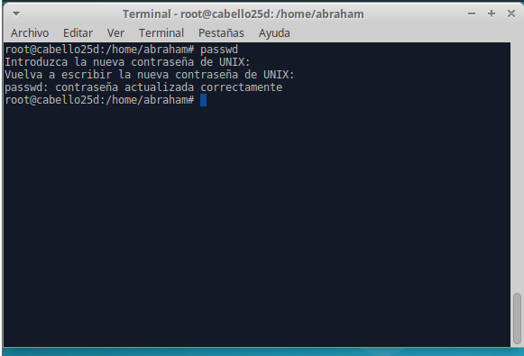

Ahora abrimos el terminal para instalar el ssh
> sudo apt-get install ssh

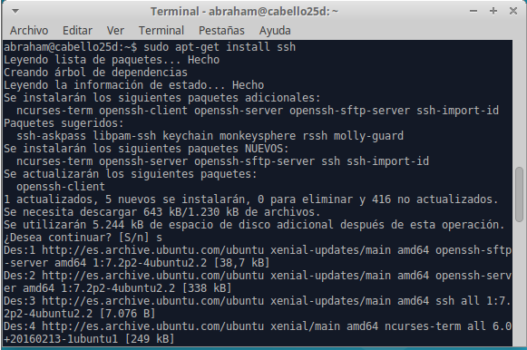

Comprobamos desde la maquina real que tiene conexion **ssh** una vez introducido el comando nos pide la contraseña del root creada anteriormente
>ssh root@ip_del_servidor

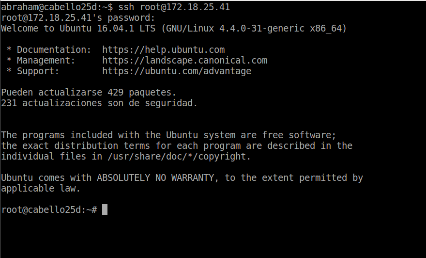

Metemos los siguientes comando para comprobar los cambios.

~~~
date
uname -a
hostname -a
hostname -d
tail -n 5 /etc/passwd
route -n
~~~
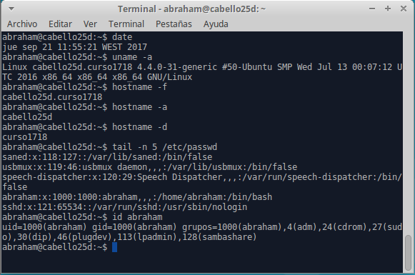

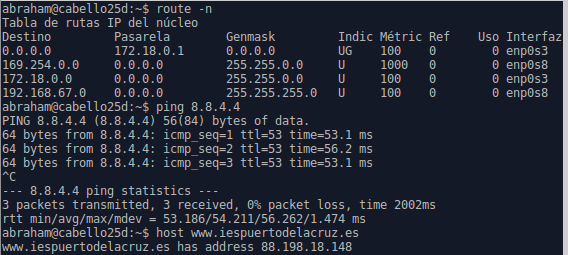
___

##### Creación de Usuario

Creamos varios usuarios para luego acceder de nuestra maquina cliente; usamos el siguinte comando.

>useradd -d /home/nombre_del_usuario-m -s /bin/bash nombre_de_usuario

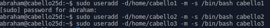

##### Instalación del servicio LTSP y creación de Imagenes.

Abrimos un terminal y escribimos el siguiente comando:(Instala el servicio)

>sudo apt-get install ltsp-server-standalone

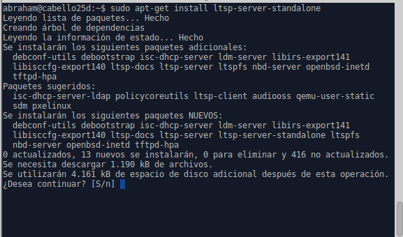

Ahora seguimos en la terminal y copiamos el siguiente comando para crear una imagen que la utilizara la maquina cliente.

>ltsp-build-client

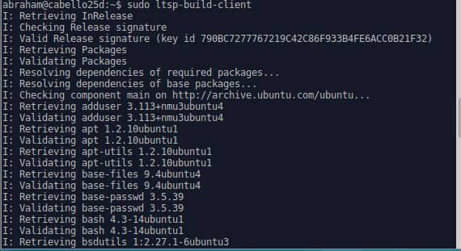

Una vez que termine la creacion de la imagen nos aseguramos que esta bien creada con el siguiente comando:

> ltsp-info

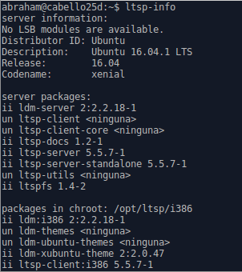

##### Configuración LTSP

Vamos al archivo "**/etc/ltsp**" y lo modificamos:

> Rango de ip 192.168.67.125 a 192.168.17.225
/opt/ltsp/i386(esta es la imagen)
/ltsp/i386/pxelinux.0

Ahora nos aseguramos que los servicios dhcp y ftp estan activos.
Ya que al instalar el servidor ltsp tambien nos da eso servicios.

>ps -ef|grep dhcp
ps -ef|grepftp

### Maquina cliente

* Ahora vamos a comprobar si la maquina cliente coje, ip del nuestro dhcp y entra con la imagen que creamos anterior mente.

Arrancamos nuestra maquina cliente y se pondra a buscar una ip y la imagen.

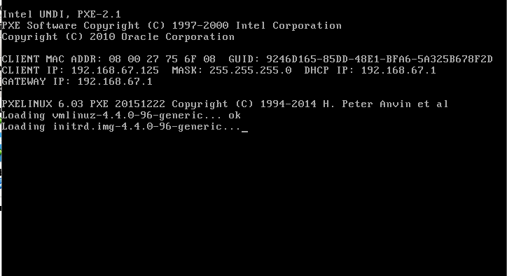

Vemos que encuentra ip y la imagen , se trendria que mostrar la siguiente pantalla.

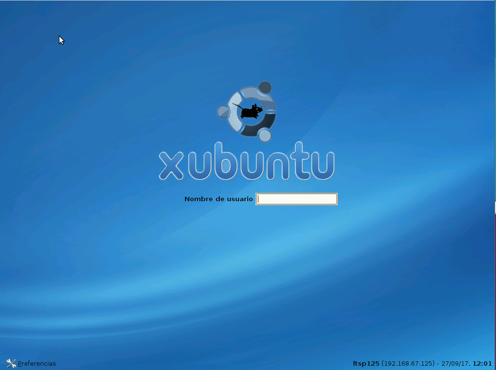

Ahora vamos a acceder con un usuario para verificar que nuestros clientes ligeros funcionan.

Entramos con el usuario "**cabello1**" en mi caso y comprobamos que estamos dentro del dominio.

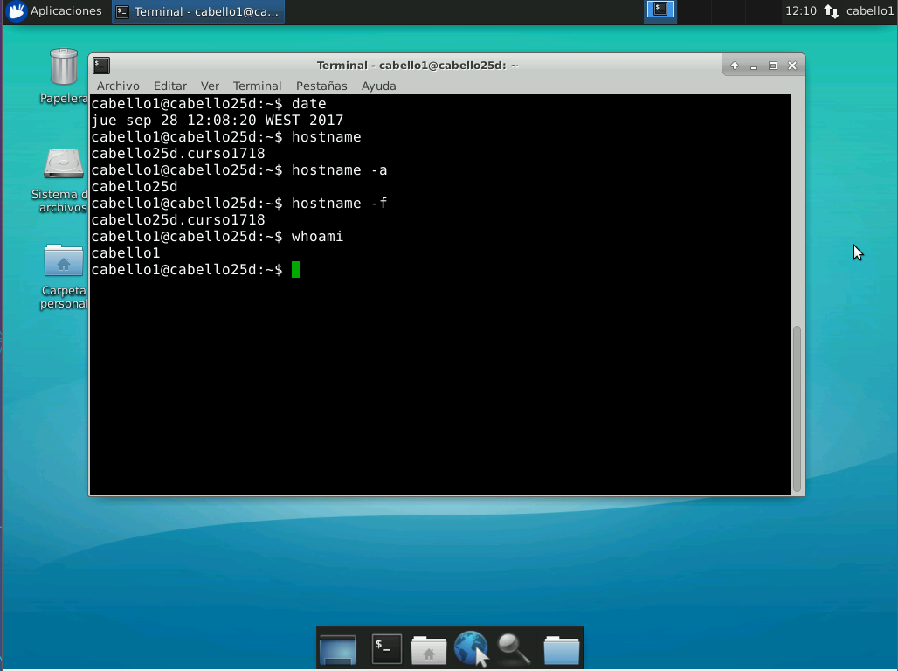

### Video de demostración

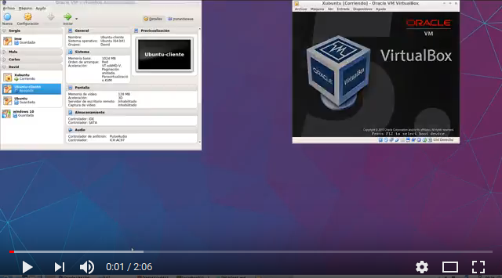(https://youtu.be/rt9X8cPsRvU)
