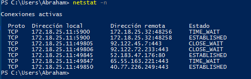

## Configuración OpenSuse

Utilizamos Ip fijas tanto en cliente como servidor

* Configuración del servidor:

Vamos a Yast al apartado de red configuramos Nombre de Host/DNS

Encaminamiento (Puerta de enlace)

Tarjeta de red

* Configuración cliente

Nombre de Host/DNS

Encaminamiento

Tarjeta de red

### Instalación de VNC OpenSuse Leap 42.2

Abrimos el Yast , instalamos y activamos servicio VNC acceso remoto.

Permintimos la administración

Y le damos a instalar

Una vez instalado, abrimos el terminal escribimos "vncserver" creamos una contraseña para la admin y el acceso remoto.

#### VncViewer

Es la herramineta que vamos usar para acceder remotamente a los equipo , viene por defecto en el sistema OpenSuse, la usaremos en el equipo cliente.

## Configuración de Windows 10

Vamos a usar Ip fijas tanto para la maquina cliente como servidor.

En el servidor usaremos la siguiente configuración:

En la maquina cliente:

### Instalación de VNC_Server Windows 10

Vamos a utilizar el programa "TightVNC server"

Utilizamos la instalación "Custom"

Quitamos el cliente del programa "TightVNC Viewer"

Dejamos las configuraciónes por defecto

Y le damos a instalar

Despues nos piden una contrasseña de admin y otra para acceso remoto

Y le damos a finalizar

### Instalación de Vnc_Viewer Windows 10

Hacemos los mismos pasos que el anterior lo uncio que cambian es la Instalación "Custom", quitamos ahora el server y dejamos el cliente "TightVNC_viewer"

> La contraseña del paso anterior solo es en el servidor

## Conexion remota de Windows a Windows

Vamos acceder con la maquina cliente  al servidor, abrimos el TightVNC_viewer.

>Colocamos la IP del servidor y le damos a conectar.

Nos pide la contraseña del acceso remoto

Y tenemos la conexion terminada

Comprobamos con el comando "netstat -n para ver dicha conexion, utiliza el puerto :5900"

## Conexion remota de linux a linux

Accedemos con la maquina cliente al servidor con la herramineta VncViewer.

Nos pide la contraseña del acceso remoto y entremos en el servidor.

Abrimos el terminal y comprobamos la conexion con el comando "netstat -ntap | grep y la ip del servidor"

## Conexion remota linux a windows

Abrimos el terminal de OpenSuse y accedemos con el comando "VncViewer" a la maquina de windows 10

Nos pide la contrasela del acceso remoto y accedemos a la maquina y comprobamos con el comando "netstat -n"

>La ip es 172.18.25.32:48258

## Conexion remota windows a linux

Abrimos el programa TightVNC y accedemos a maquina OpenSuse entramos con el puerto que nos asigno el porgrama de linux

Nos pide la contraseña de acceso

Y entramos en la maquina

Comprobamos la conexion

