# Servidor Samba

  * Preparativos

    * Servidor:
      * S.O: OpenSUse
      * IP Fija:

        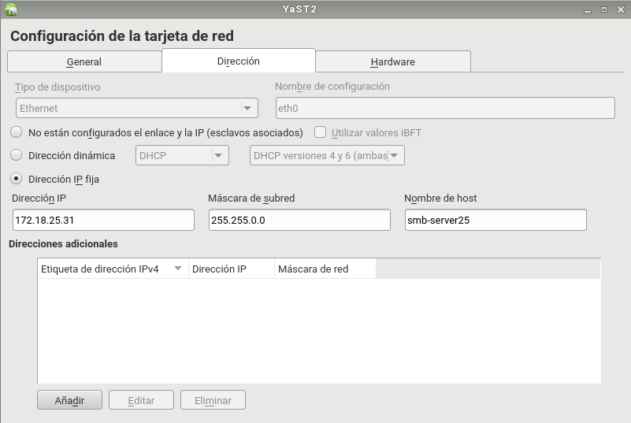

        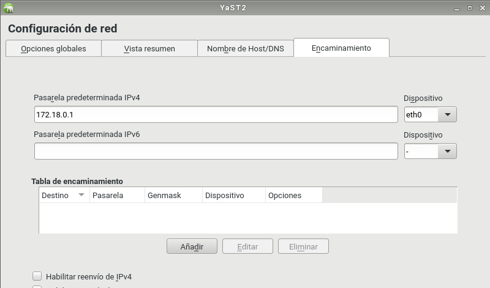

      * Nombre de equipo y DNS:

        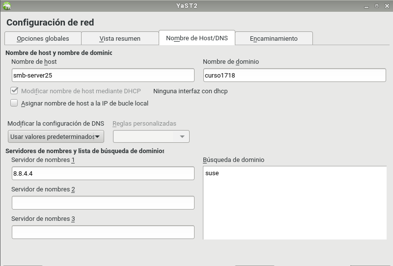

      * Añadir los equipos clientes en `/etc/hosts/`

        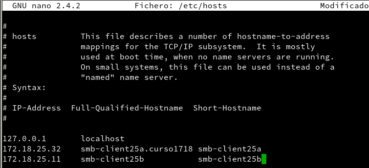

        * Comandos de comprobación.

        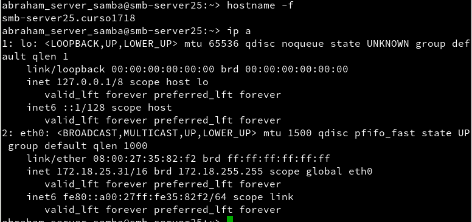
        

    * Cliente Linux:
      * S.O: OpenSUse
      * IP Fija:

        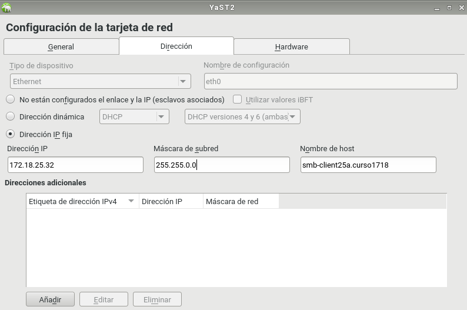

        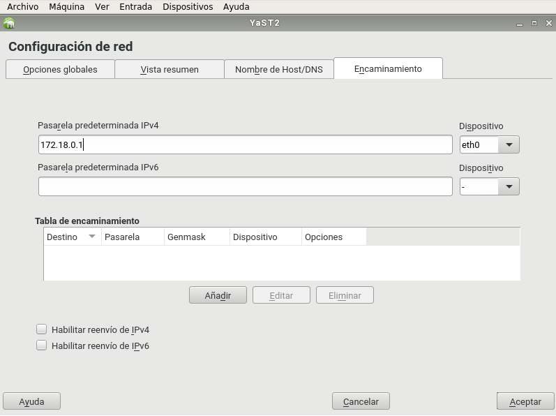

      * Nombre de equipo y DNS:

        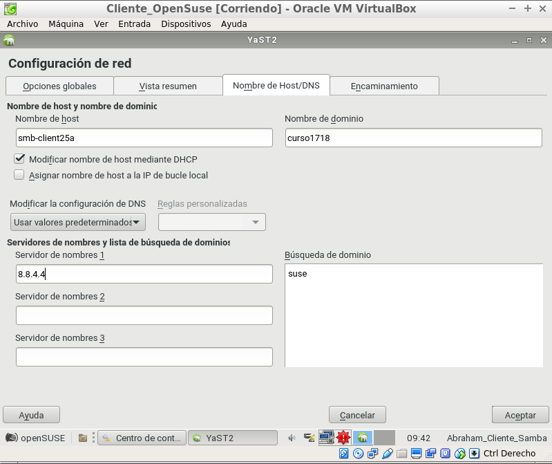

    * Cliente Linux:
      * S.O: OpenSUse
      * IP Fija:

        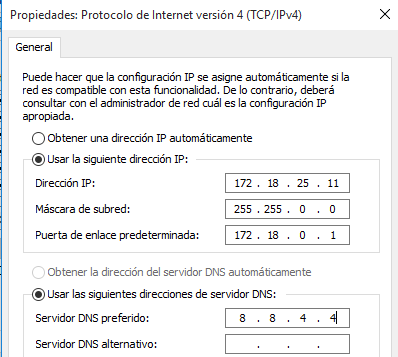

      * Añadir los equipos clientes en `/etc/hosts/`

        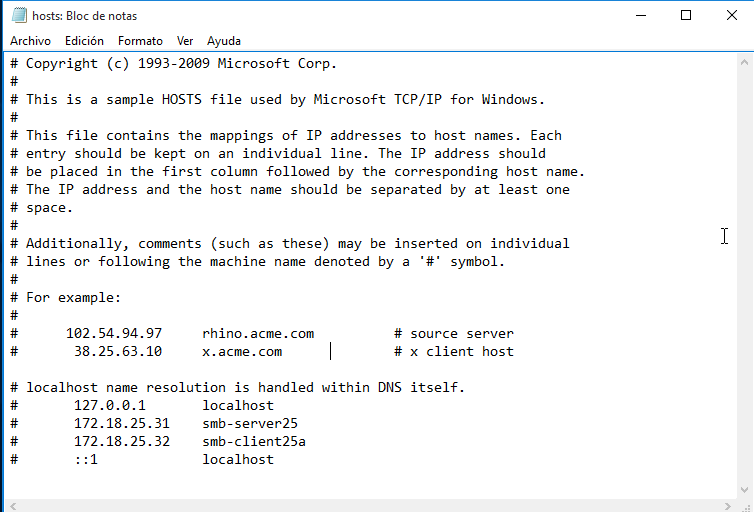

      * Nombre de equipo y Grupo de trabajo:

        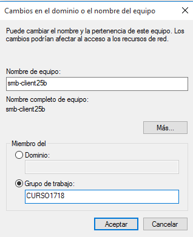

## Usuarios Locales

  * Crear los grupos piratas, soldados y todos.

    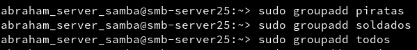

  * Crear el usuario smbguest y  supersamba.

    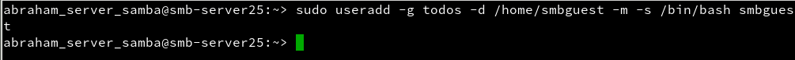

    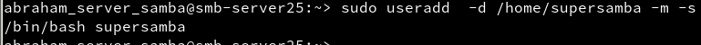

  * Para asegurarnos que nadie puede usar smbguest para entrar en nuestra máquina mediante login, vamos a modificar este usuario y le ponemos como shell  ``/bin/false``.

    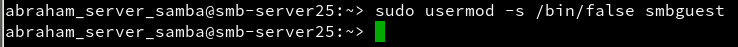

  * Dentro del grupo piratas incluir a los usuarios pirata1, pirata2.

    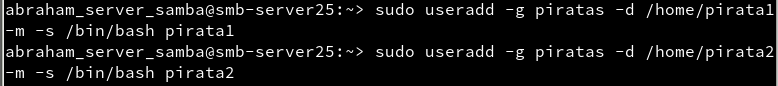

  * Dentro del grupo soldados incluir a los usuarios soldado1 y soldado2.

    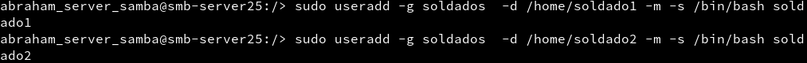

  * Dentro del grupo todos, poner a todos los usuarios soldados, pitatas, supersamba y a smbguest.

    

  * Incluimos a supersamba en todos los grupos.

    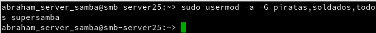

  * Resumen

    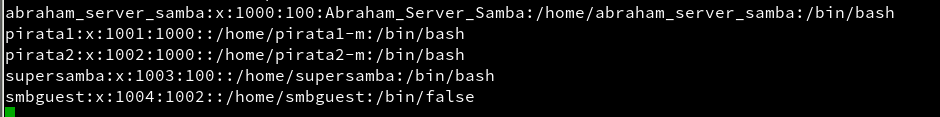

## Crear las carpetas para los futuros recursos compartidos

* Vamos a crear las carpetas de los recursos compartidos con los permisos siguientes:

  * ``/srv/sambaXX/public.d``
    *  Usuario propietario supersamba.
    *  Grupo propietario todos.
    *  Poner permisos 775.

      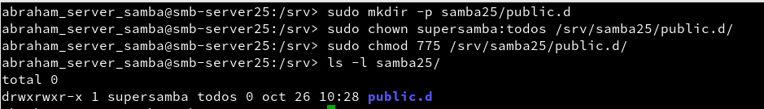

  * ``/srv/sambaXX/castillo.d``
    *  Usuario propietario supersamba.
    *  Grupo propietario soldados.
    *  Poner permisos 770.

      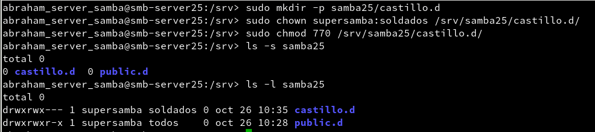

  * ``/srv/sambaXX/barco.d``
    *  Usuario propietario supersamba.
    *  Grupo propietario piratas.
    *  Poner permisos 770.

      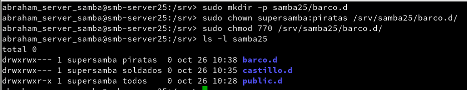

## Configurar el servidor Samba

  * Vamos a hacer una copia de seguridad del fichero de configuración existente ``cp /etc/samba/smb.conf /etc/samba/smb.conf.000``.

    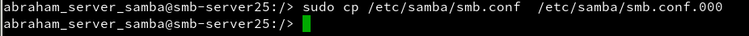

  * Yast -> Samba Server
    * Workgroup: mar1718
    * Sin controlador de dominio.

      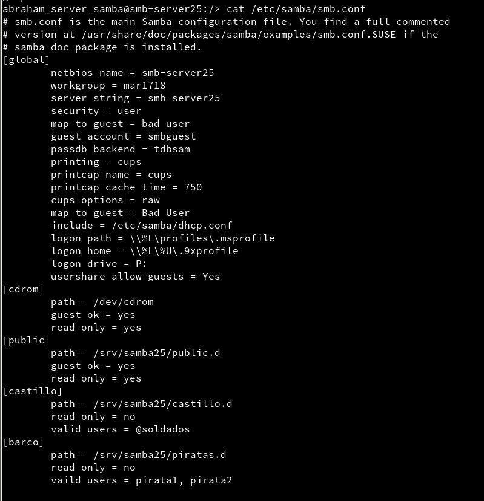

  * En la pestaña de Inicio definimos

   *  Iniciar el servicio durante el arranque de  la máquina.
   * Ajustes del cortafuegos -> Abrir puertos

   > Vamos a la herraminenta Yast, cortafuegos y en zona externa añadimos servidor samba.

## Crear los recursos compartidos de Samba

  * Abrimos terminal y modificamos el archivo ``/etc/samba/smb.conf`` y creamos los recursos ``[cdrom]``, ``[public]``, `[castillo]`, ``[barco]``, y modificamos el Workgroup.

    

  * Comprobamos con los comandos:

    * `testparm`

      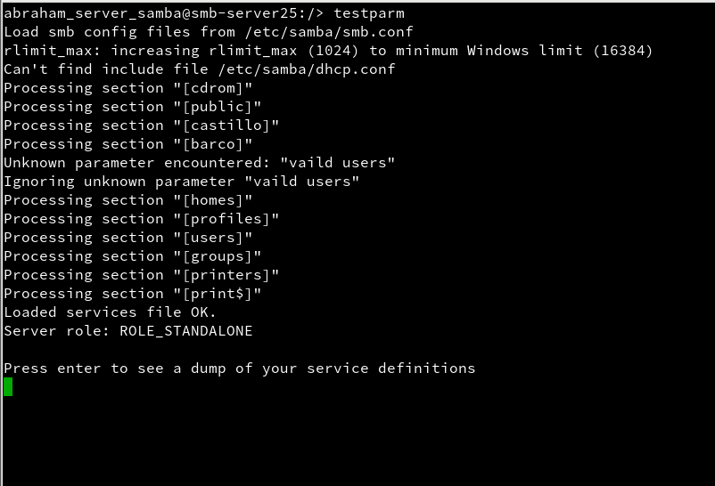

## Usuarios Samba

* Después de crear los usuarios en el sistema, hay que añadirlos a Samba.

  * smbpasswd -a nombreusuario, para crear clave de Samba para un usuario del sistema.

    

  * pdbedit -L, para comprobar la lista de usuarios Samba.

    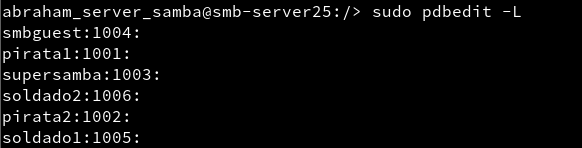

## Reinicio y comprobación

*  Ahora que hemos terminado con el servidor, hay que reiniciar el servicio para que se lean los cambios de configuración.

    * Servicio smb
      *  systemctl stop smb
      *  systemctl start smb
      *  systemctl status smb

        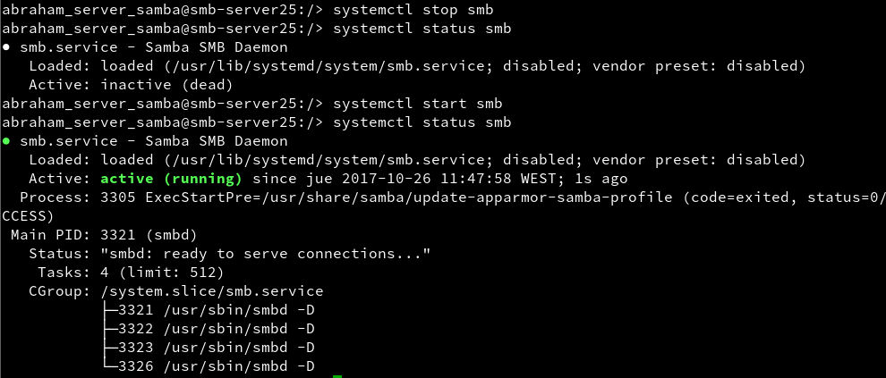

    * Servicio nmb
        * systemctl stop nmb
        *  systemctl start nmb
        *  systemctl status nmb

          

    * Comprobamos

        * testparm:

          

        * netstat -tap:

          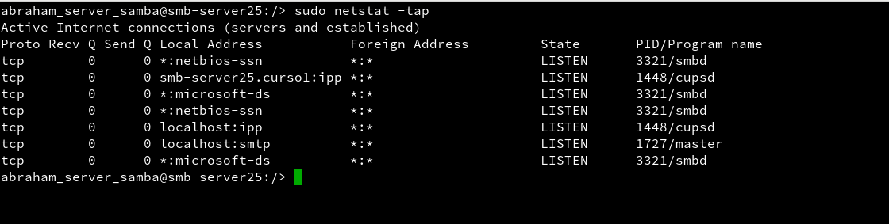

        * nmap -Pn

          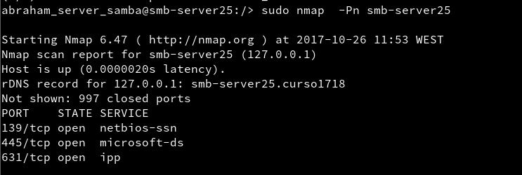

## Cliente Windows

  * Desde un cliente Windows vamos a acceder a los recursos compartidos del servidor Samba con la "**ip-del-servidor-samba**"

  * Comprobar los accesos de todas las formas posibles. Como si fuéramos:

    *  un soldado:

      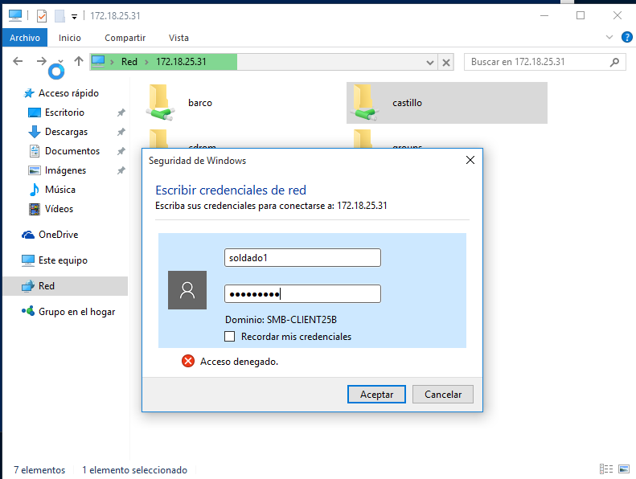

      

    *  un pirata:

      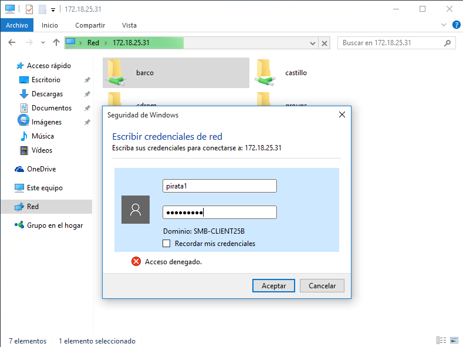

      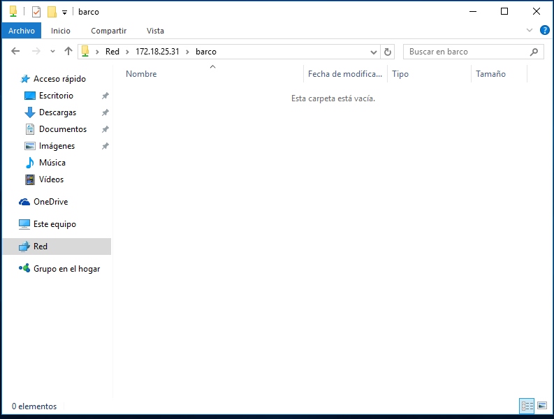

    > Después de cada conexión se quedan guardada la información en el cliente Windows (Ver comando net use).
    net use * /d /y, para cerrar las conexión SMB/CIFS que se ha realizado desde el cliente al servidor.

      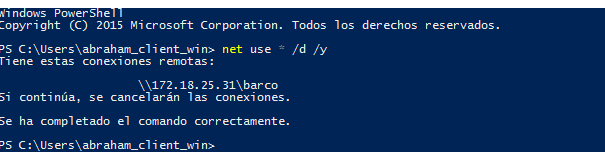

  * Comprobación

    *  smbstatus, desde el servidor Samba.
    *  netstat -ntap, desde el servidor Samba.

      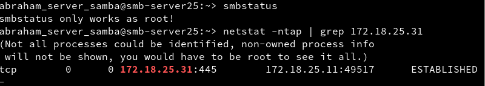

    *  netstat -n, desde el cliente Windows.

      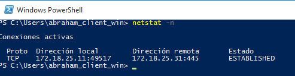

## Cliente Windows comandos

  * El comando net use ip-servidor-samba\recurso clave /USER:usuario establece una conexión con el recurso compartido y lo monta en la unidad S. Probemos a montar el recurso barco.

    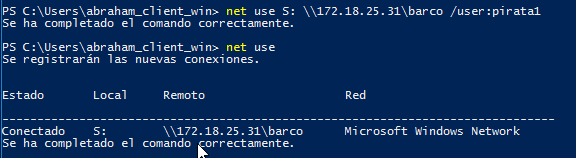

* Capturar imagen de los siguientes comandos para comprobar los resultados:

  *  smbstatus, desde el servidor Samba.
  *  netstat -ntap, desde el servidor Samba.

      

  *  netstat -n, desde el cliente Windows.

      

## Cliente GNU/Linux

* Desde en entorno gráfico, podemos comprobar el acceso a recursos compartidos SMB/CIFS.

  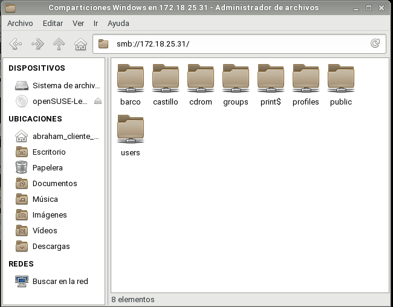

  * Castillo

    

    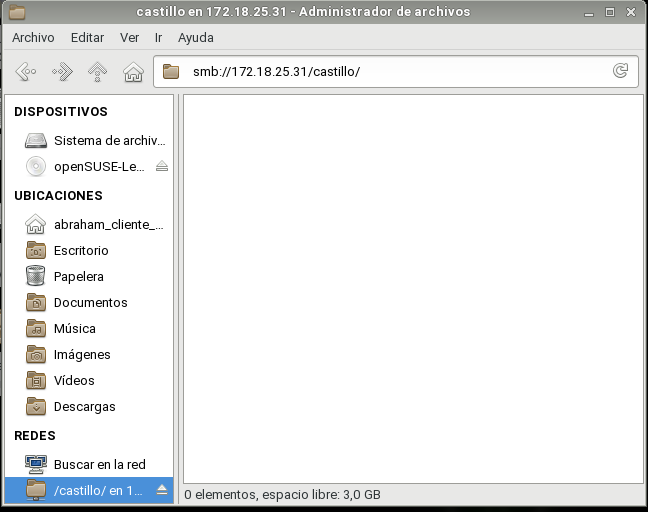

  * Barco

    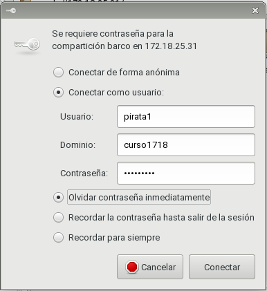

    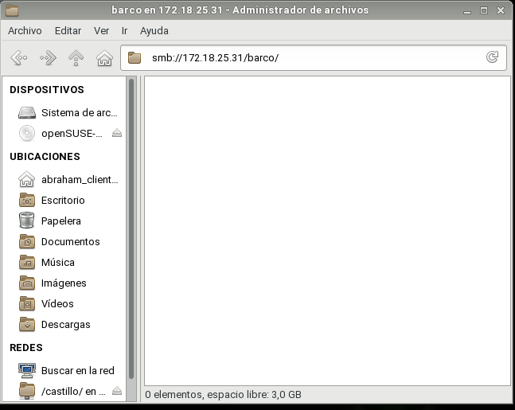

  * Public

    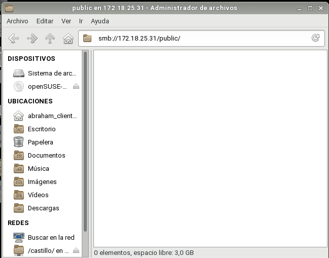

  * Comprobación

    * netstat -ntap, desde el servidor Samba.

      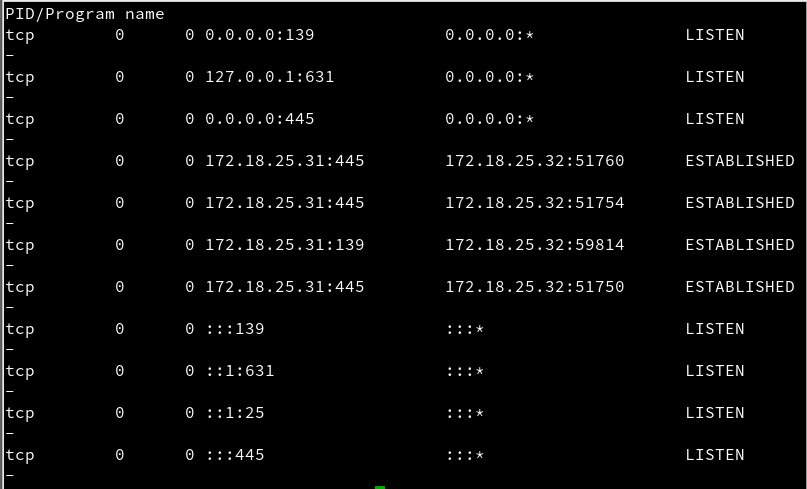

    * netstat -ntap, desde el cliente Linux.

      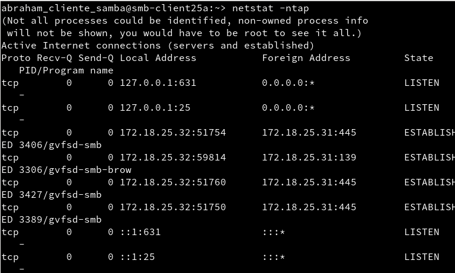

## Cliente GNU/Linux comandos

  * Vamos a un equipo GNU/Linux que será nuestro cliente Samba. Desde este equipo usaremos comandos para acceder a la carpeta compartida.
  * Primero comprobar el uso de las siguientes herramientas:

    * sudo smbtree   : Muestra todos lo equipos/recursos de la red SMB/CIFS.

      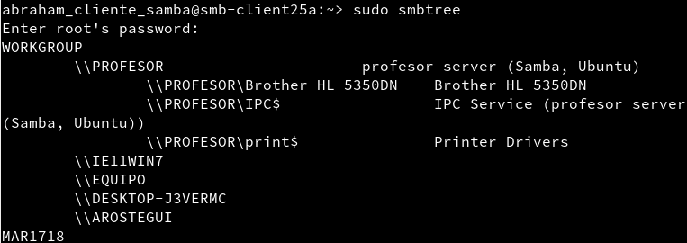

    * smbclient :Muestra los recursos SMB/CIFS de un equipo concreto

      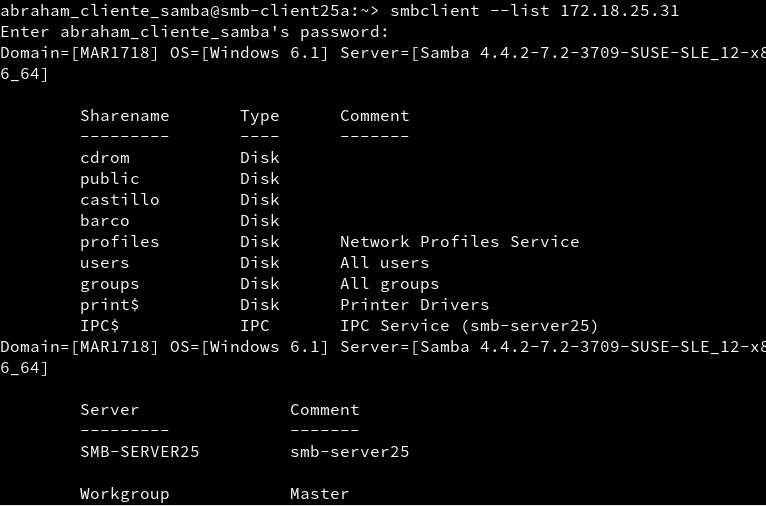

  * Ahora crearemos en local la carpeta ``/mnt/sambaXX-remoto/castillo``

      

  * MONTAJE: Con el usuario root, usamos el siguiente comando para montar un recurso compartido de Samba Server, como si fuera una carpeta más de nuestro sistema: ``mount -t cifs //172.18.XX.55/castillo/mnt/sambaXX-remoto/castillo -o username=soldado1``

      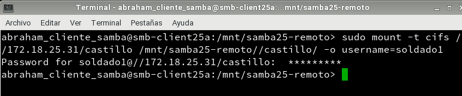

  * COMPROBAR: Ejecutar el comando df -hT. Veremos que el recurso ha sido montado.

    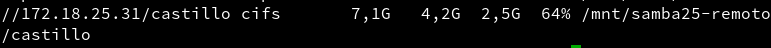

  * Comprobación

  *  smbstatus, desde el servidor Samba.
  *  netstat -ntap, desde el servidor Samba.

    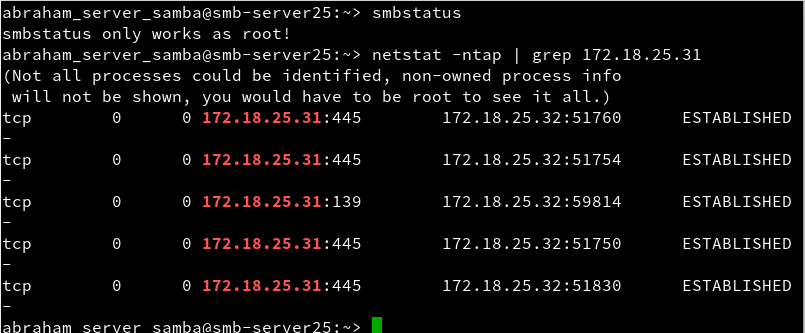

## Montaje automático

*  Para configurar acciones de montaje automáticos cada vez que se inicie el equipo, debemos configurar el fichero /etc/fstab. Veamos un ejemplo:

``//smb-serverXX/public /mnt/remotoXX/public cifs username=soldado1,password=clave 0 0``

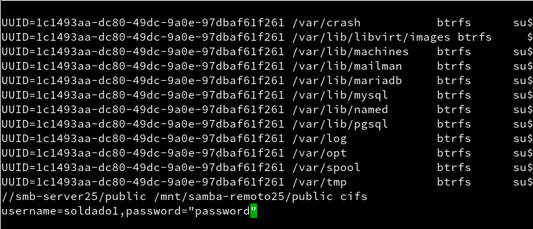

* Reiniciar el equipo y comprobar que se realiza el montaje automático al inicio.

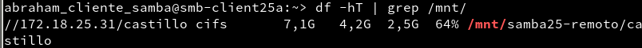

## Preguntas para resolver

  *  ¿Las claves de los usuarios en GNU/Linux deben ser las mismas que las que usa Samba?
  Si

  *  ¿Puedo definir un usuario en Samba llamado soldado3, y que no exista como usuario del sistema?
  No
  *  ¿Cómo podemos hacer que los usuarios soldado1 y soldado2 no puedan acceder al sistema pero sí al samba? (Consultar /etc/passwd)
  si , colocando en bin/bash sea false
  *  Añadir el recurso [homes] al fichero smb.conf según los apuntes. ¿Qué efecto tiene?
