# Vagrant y VirtualBox


## 2.1 Instalar

La instalación debemos hacerla en una máquina real.

  *  Hay varias formas de instalar Vagrant:
    `apt-get install vagrant` o Usando un paquete Vagrant-deb Disponible para descargar del servidor Leela.
    >vagrant version, para comprobar la versión actual de Vagrant.
    >VBoxManage -v, para comprobar la versión actual de VirtualBox.


  *  Si vamos a trabajar Vagrant con MV de VirtualBox, hay que comprobar que las versiones de ambos son compatibles entre sí.

  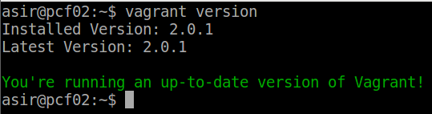

## 2.2. Proyecto

  *  Crear un directorio para nuestro proyecto vagrant :

    *  mkdir mivagrantXX
    *  cd mivagrantXX
    *  vagrant init

  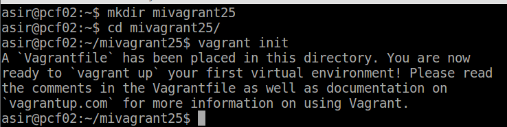


## 2.3 Imagen, caja o box

  *  Ahora necesitamos obtener una imagen(caja, box) de un sistema operativo. Vamos, por ejemplo, a conseguir una imagen de un Ubuntu Precise de 32 bits:

  * vagrant box add micajaXX_ubuntu_precise32 http://files.vagrantup.com/precise32.box

  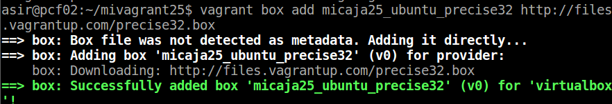

  * vagrant-box-add

  *  vagrant box list: Lista las cajas/imágenes disponibles actualmente en nuestra máquina.

  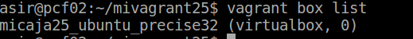

  * Para usar una caja determinada en nuestro proyecto, modificamos el fichero Vagrantfile (dentro de la carpeta de nuestro proyecto).

  *  Cambiamos la línea config.vm.box = "base" por config.vm.box = "micajaXX_ubuntu_precise32".

  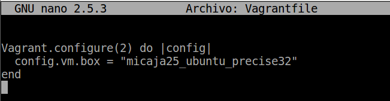


## 2.4 Iniciar una nueva máquina

* Vamos a iniciar una máquina virtual nueva usando Vagrant:

  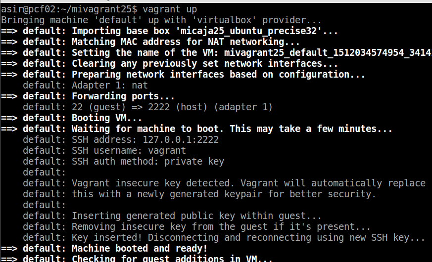

  >  vagrant up: comando para iniciar una nueva instancia de la máquina.


*  vagrant ssh: Conectar/entrar en nuestra máquina virtual usando SSH.

  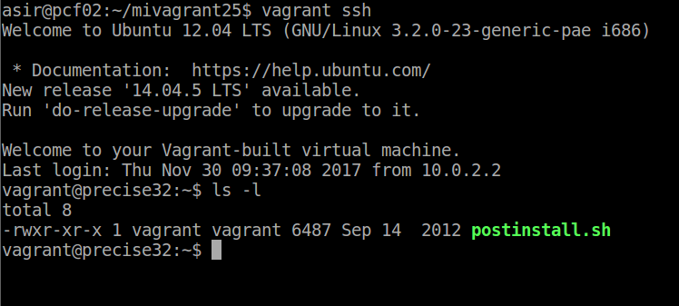

  *  Otros comandos últiles de Vagrant son:
      >Vagrant suspend: Suspender la máquina virtual. Tener en cuenta que la MV en modo suspendido consume más espacio en disco debido a que el estado de la máquina virtual que suele almacenarse en la RAM se pasa a disco.

      > Vagrant resume : Volver a despertar la máquina virtual.
      > vagrant halt: Apagarla la máquina virtual.

      >vagrant status: Estado actual de la máquina virtual.

      >vagrant destroy: Para eliminar la máquina virtual (No los ficheros de configuración).


## 3. Configuración del entorno virtual

## 3.1 Carpetas sincronizadas

  *  La carpeta del proyecto que contiene el Vagrantfile es visible para el sistema el virtualizado, esto nos permite compartir archivos fácilmente entre los dos entornos.

  *  Para identificar las carpetas compartidas dentro del entorno virtual, hacemos:

>vagrant ssh => Ya estamos dentro de la maquina
>ls /vagrant

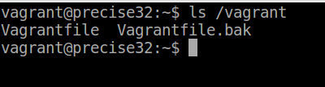

  >  Esto nos mostrará que efectivamente el directorio /vagrant dentro del entorno virtual posee el mismo Vagrantfile que se encuentra en nuestro sistema anfitrión.

## 3.2 Redireccionamiento de los puertos

* Cuando trabajamos con máquinas virtuales, es frecuente usarlas para proyectos enfocados a la web, y para acceder a las páginas es necesario configurar el enrutamiento de puertos.

*  Entramos en la MV e instalamos apache.

  >apt-get install apache2

  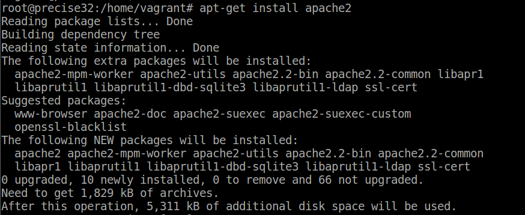

  *  Modificar el fichero Vagrantfile, de modo que el puerto 4567 del sistema anfitrión sea enrutado al puerto 80 del ambiente virtualizado.

    >config.vm.network :forwarded_port, host: 4567, guest: 80

  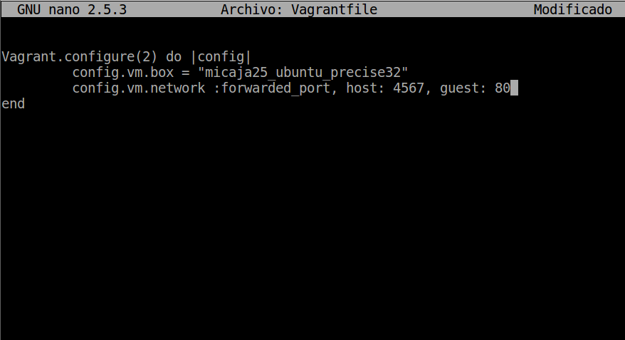

  *  Luego iniciamos la MV (si ya se encuentra en ejecución lo podemos refrescar con vagrant reload)

  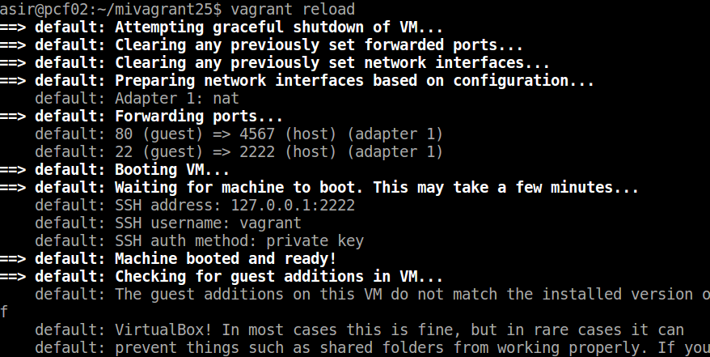

  * Para confirmar que hay un servicio a la escucha en 4567, desde la máquina real podemos ejecutar los siguientes comandos:

  >  nmap -p 4500-4600 localhost, debe mostrar 4567/tcp open tram.

  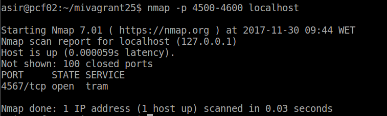

  >  netstat -ntap, debe mostrar tcp 0.0.0.0:4567 0.0.0.0:* ESCUCHAR.

  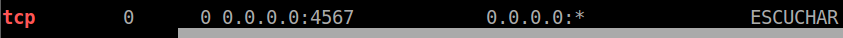

  *  En la máquina real, abrimos el navegador web con el URL http://127.0.0.1:4567.

  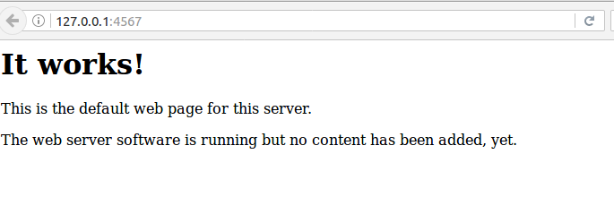

  >En realidad estamos accediendo al puerto 80 de nuestro sistema virtualizado.

## 5.Suministro

* Una de los mejores aspectos de Vagrant es el uso de herramientas de suministro. Esto es, ejecutar "una receta" o una serie de scripts durante el proceso de arranque del entorno virtual para instalar, configurar y personalizar un sin fin de aspectos del SO del sistema anfitrión.

*  vagrant halt, apagamos la MV.

  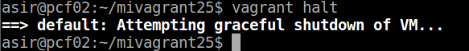

*    vagrant destroy y la destruimos para volver a empezar.

  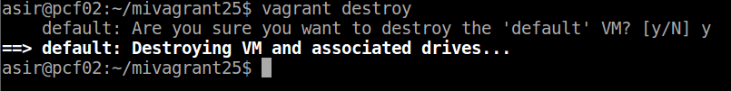

* 5.1 Suministro mediante shell script

Ahora vamos a suministrar a la MV un pequeño script para instalar Apache.

*  Crear el script install_apache.sh, dentro del proyecto con el siguiente contenido:

```
#!/usr/bin/env bash
apt-get update
apt-get install -y apache2
rm -rf /var/www
ln -fs /vagrant /var/www
echo "Actividad de Vagrant" > /var/www/index.html
echo "Curso201516" >> /var/www/index.html
echo "Nombre-del-alumno" >> /var/www/index.html
```
  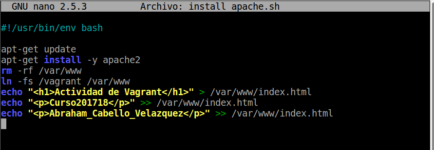

*  Poner permisos de ejecución al script.

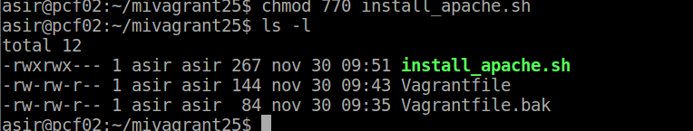

* Vamos a indicar a Vagrant que debe ejecutar dentro del entorno virtual un archivo install_apache.sh.

  *  Modificar Vagrantfile y agregar la siguiente línea a la configuración: config.vm.provision :shell, :path => "install_apache.sh"


  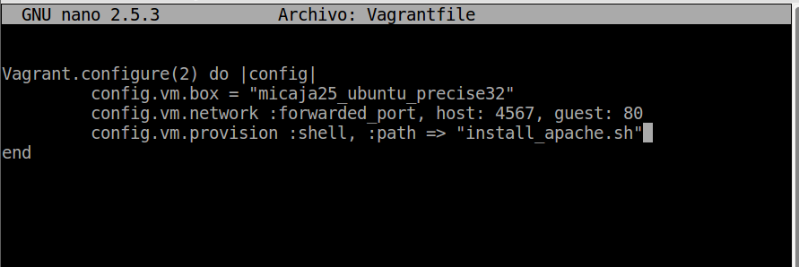

  *  Si usamos los siguiente config.vm.provision "shell", inline: '"echo "Hola"', ejecuta directamente el comando especificado.

  *  Volvemos a crear la MV.

    > Vagrant Up

  *  Podemos usar vagrant reload si está en ejecución para que coja el cambio de la configuración.

* Podremos notar, al iniciar la máquina, que en los mensajes de salida se muestran mensajes que indican cómo se va instalando el paquete de Apache que indicamos.

  *  Para verificar que efectivamente el servidor Apache ha sido instalado e iniciado, abrimos navegador en la máquina real con URL http://127.0.0.1:4567.

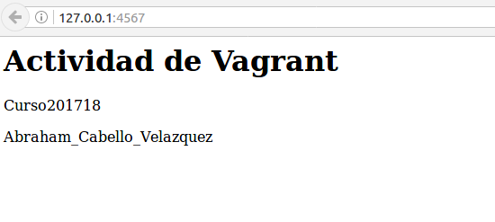

## 5.2 Suministro mediante Puppet

  *  Modificar el archivo el archivo Vagrantfile de la siguiente forma:
```
Vagrant.configure(2) do |config|
  ...
  config.vm.provision "puppet" do |puppet|
    puppet.manifest_file = "default.pp"
  end
 end
```
  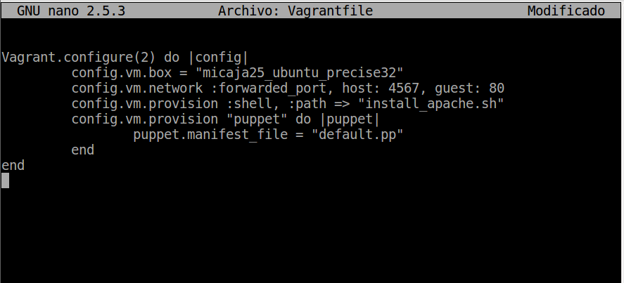

  *  Crear un fichero manifests/default.pp, con las órdenes/instrucciones puppet para instalar el programa nmap. Ejemplo:

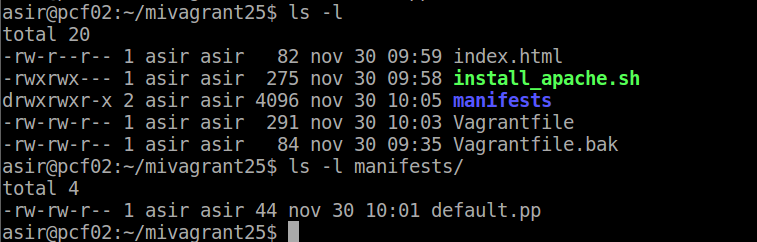

```
package { 'nmap':
  ensure => 'present',
}
```
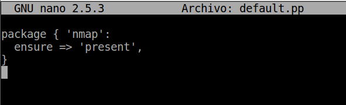

* Para que se apliquen los cambios de configuración, tenemos dos formas:

  *  (A) Parar la MV, destruirla y crearla de nuevo (vagrant halt, vagrant destroy y vagrant up).

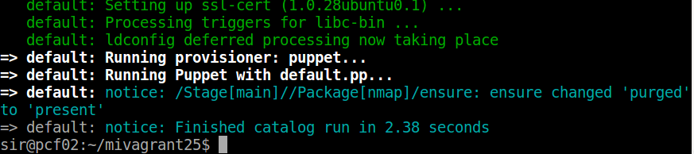

  *  (B) Con la MV encendida recargar la configuración y volver a ejecutar la provisión (vagrant reload, vagrant provision).

## 6. Nuestra caja personalizada

En los apartados anteriores hemos descargado una caja/box de un repositorio de Internet, y luego la hemos provisionado para personalizarla. En este apartado vamos a crear nuestra propia caja/box personalizada a partir de una MV de VirtualBox.

## 6.1 Preparar la MV VirtualBox

* Lo primero que tenemos que hacer es preparar nuestra máquina virtual con una configuración por defecto, por si queremos publicar nuestro Box, ésto se realiza para seguir un estándar y que todo el mundo pueda usar dicho Box.

  *  Crear una MV VirtualBox nueva o usar una que ya tengamos.
    Instalar OpenSSH Server en la MV.

    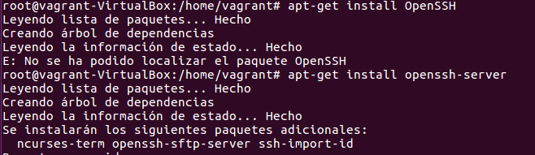

  *  Indicaciones de ¿Cómo crear una Base Box en Vagrant a partir de una máquina virtual para preparar la MV de VirtualBox.

  *  Crear el usuario vagrant, para poder acceder a la máquina virtual por SSH. A este usuario le agregamos una clave pública para autorizar el acceso sin clave desde Vagrant.

  * useradd -m vagrant
  * su - vagrant
  * mkdir .ssh

    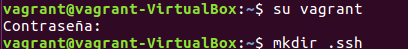

  * wget https://raw.githubusercontent.com/mitchellh/vagrant/master/keys/vagrant.pub-O.ssh/authorized_keys

    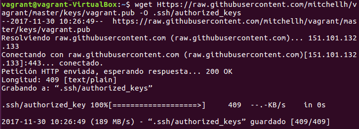

  * chmod 700 .ssh
  * chmod 600 .ssh/authorized_keys

    

  *  Poner clave vagrant al usuario vagrant y al usuario root.

    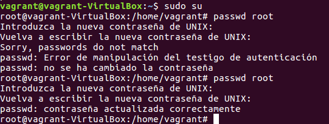

    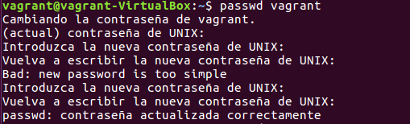

* Tenemos que conceder permisos al usuario vagrant para que pueda configurar la red, instalar software, montar carpetas compartidas, etc. para ello debemos configurar /etc/sudoers (visudo) para que no nos solicite la password de root, cuando realicemos estas operación con el usuario vagrant.

  >  Añadir vagrant ALL=(ALL) NOPASSWD: ALL a /etc/sudoers.

  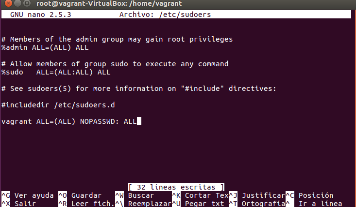


# 6.2 Crear la caja vagrant

* Una vez hemos preparado la máquina virtual ya podemos crear el box.

  *  Vamos a crear una nueva carpeta mivagrantXXconmicaja, para este nuevo proyecto vagrant.
  *  Ejecutamos vagrant init para crear el fichero de configuración nuevo.

  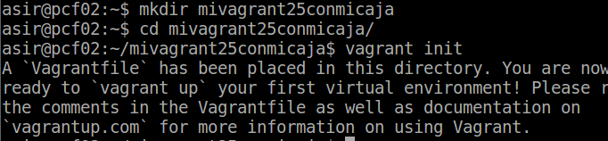

  *  Localizar el nombre de nuestra máquina VirtualBox.

  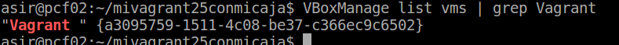

  *  Crear la caja package.box a partir de la MV.

  >vagrant-package --base "Nombre de la maquina"

  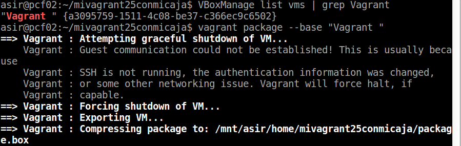

  *  Comprobamos que se ha creado la caja package.box en el directorio donde hemos ejecutado el comando.

  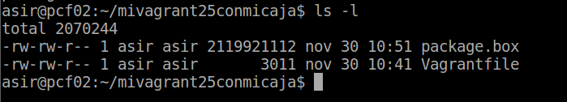

  * Agregamos la caja con vagrant-box-add.

  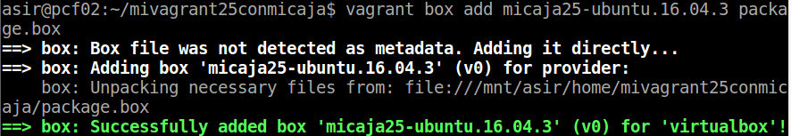

  * M0odificamos el archivo Vegrantfile.

  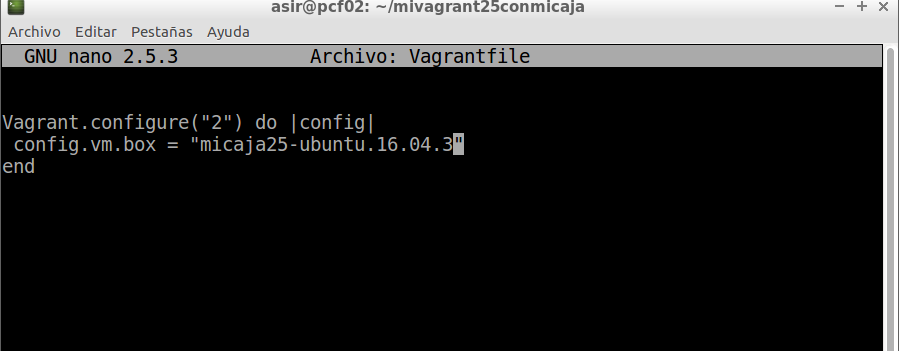

  * Hacemos un Vagrant Up

  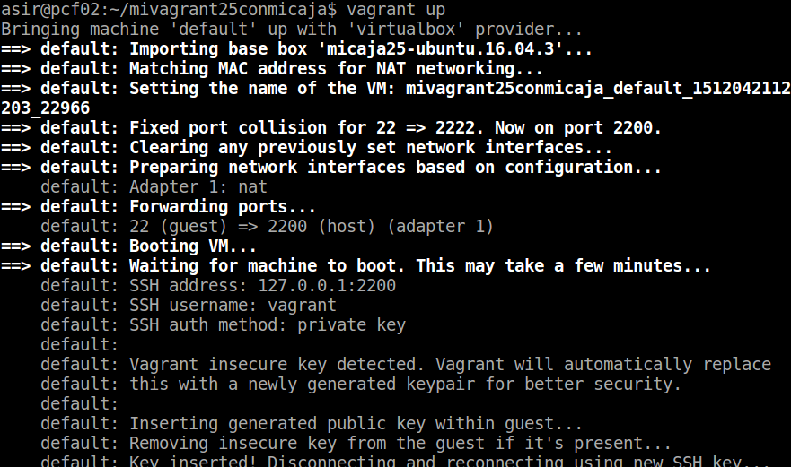

  * Comprobación de que se conecta a la maquina.

  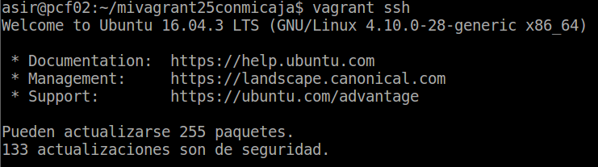
