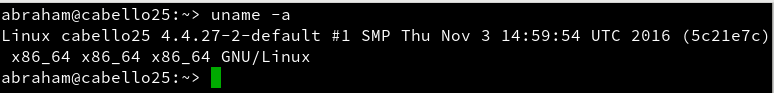
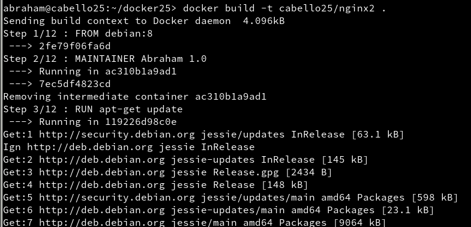

# Docker

### 1. Introducción

Es muy común que nos encontremos desarrollando una aplicación y llegue el momento que decidamos tomar todos sus archivos y migrarlos ya sea al ambiente de producción, de prueba o simplemente probar su comportamiento en diferentes plataformas y servicios. Para situaciones de este estilo existen herramientas que, entre otras cosas, nos facilitan el embalaje y despliegue de la aplicación, es aquí donde entra en juego Docker.

Esta herramienta nos permite crear lo que ellos denominan contenedores, lo cual son aplicaciones empaquetadas auto-suficientes, muy livianas que son capaces de funcionar en prácticamente cualquier ambiente, ya que tiene su propio sistema de archivos, librerías, terminal, etc.
Docker es una tecnología contenedor de aplicaciones construida sobre LXC.

### 2. Requisitos

Vamos a usar MV OpenSUSE. Nos aseguraremos que tiene una versión del Kernel 3.10 o superior (uname -a).



### 3.Instalación y primeras pruebas

zypper in docker(**Instala Docker**)


systemctl start docker(**Inicia el servicio**)


usermod -a -G docker USERNAME(**Añade permisos a nuestro usuario**)


> Entramos con el usuario abraham.
  Ejecutar con nuestro usuario para comprobar que todo funciona:

docker images(**Muestra las imágenes descargadas hasta ahora**)
docker ps -a (**Muestra todos los contenedores creados**)
docker run hello-world (**Descarga y ejecuta un contenedor con la imagen hello-world**)


docker images
docker ps -a(**El contenedor está estado 'Exited'**)


### 4. Configuración de la red

Habilitar el acceso a la red externa a los contenedores

Si queremos que nuestro contenedor tenga acceso a la red exterior, debemos activar la opción IP_FORWARD (net.ipv4.ip_forward). Lo podemos hacer en YAST.

¿Recuerdas lo que implica forwarding en los dispositivos de red?

  *  Para openSUSE13.2 (cuando el método de configuracion de red es Wicked). Yast -> Dispositivos de red -> Encaminamiento -> Habilitar reenvío IPv4.

    


  > IMPORTANTE.
  >
  > Cuando la red está gestionada por Network Manager, en lugar de usar YaST debemos editar el fichero >/etc/sysconfig/SuSEfirewall2 y poner FW_ROUTE="yes".
  > Para openSUSE Tumbleweed Yast -> Sistema -> Configuración de red -> Menú de encaminamiento.

Reiniciar el equipo para que se apliquen los cambios.

### 4.1 Más comandos

Información sobre otros comandos útiles:

  >docker stop CONTAINERID, parar un contenedor que estaba iniciado.
  >docker start CONTAINERID, inicia un contenedor que estaba parado.
  >docker attach CONTAINERID, conecta el terminal actual con el interior de contenedor.
  >docker ps, muestra los contenedores en ejecución.
  >docker ps -a, muestra todos los contenedores en ejecución o no.
  >docker rm CONTAINERID, eliminar un contenedor.
  >docker rmi IMAGENAME, eliminar una imagen.

### 5. Creación manual

Nuestro SO base es OpenSUSE, pero vamos a crear un contenedor Debian8, y dentro instalaremos Nginx.
5.1 Crear una imagen manualmente

### 5.1 Cómo instalar y usar docker

docker images(**Vemos las imágenes disponibles localmente**)


docker search debian(**Buscamos en los repositorios de Docker Hub**)


docker pull debian:8(**Descargamos una imagen `debian:8` en local**)


docker images


docker ps -a(**Vemos todos los contenedores**)

docker ps(**Vemos sólo los contenedores en ejecución**)


### 5.2 Crear contenedor Debian.

Vamos a crear un contenedor con nombre con_debian a partir de la imagen debian:8, y ejecutaremos /bin/bash:

* docker run --name=con_debian -i -t debian:8 /bin/bash

  

* Dentro del contenedor

* root@IDContenedor:/# cat /etc/motd(**Comprobamos que estamos en Debian**)

  

* root@IDContenedor:/# apt-get update

  

* root@IDContenedor:/# apt-get install -y nginx(**Instalamos nginx en el contenedor**)

  

* root@IDContenedor:/# apt-get install -y nano(**Instalamos editor vi en el contenedor**)

  

* root@IDContenedor:/# /usr/sbin/nginx(**Iniciamos el servicio nginx**)

  


* Creamos un fichero HTML (holamundo.html).

  


* Creamos tambien un script /root/server.sh con el siguiente contenido:

```
  #!/bin/bash

  echo "Booting Nginx!"
  /usr/sbin/nginx &

  echo "Waiting..."
  while(true) do
    sleep 60
  done
```


>Recordatorio:
>
>    Hay que poner permisos de ejecución al script para que se pueda ejecutar.
>    La primera línea de un script, siempre debe comenzar por #!/, sin espacios.
>
>    Este script inicia el programa/servicio y entra en un bucle, para permanecer activo y que no se cierre el contenedor. Más >    adelante cambiaremos este script por la herramienta supervisor.


### 5.3 Crear imagen con cambios realizados.

Ya tenemos nuestro contenedor auto-suficiente de Nginx, ahora debemos crear una nueva imagen con los cambios que hemos hecho, para esto abrimos otra ventana de terminal y busquemos el IDContenedor:

```
  david@camaleon:~/devops> docker ps
  CONTAINER ID   IMAGE      COMMAND       CREATED          STATUS         PORTS  NAMES
  7d193d728925   debian:8   "/bin/bash"   2 minutes ago    Up 2 minutes          con_debian
```


Ahora con esto podemos crear la nueva imagen a partir de los cambios que realizamos sobre la imagen base:

* docker commit

  

* docker images

  

Los estándares de Docker estipulan que los nombres de las imagenes deben seguir el formato nombreusuario/nombreimagen. Todo cambio que se haga en la imagen y no se le haga commit se perderá en cuanto se cierre el contenedor.

docker ps
docker stop con_debian  # Paramos el contenedor
docker ps
docker ps -a           # Vemos el contenedor parado
docker rm IDcontenedor # Eliminamos el contenedor
docker ps -a


### 5.4 Crear contenedor con Nginx

Bien, tenemos una imagen con Nginx instalado, probemos ahora la magia de Docker.

Iniciemos el contenedor de la siguiente manera:

docker ps
docker ps -a


docker run --name=con_nginx -p 80 -t dvarrui/nginx /root/server.sh
Booting Nginx!
Waiting...


>IMPORTANTE
>
>Los mensajes muestran que el script server.sh está en ejecución. No parar el programa. Es correcto.
>El argumento -p 80 le indica a Docker que debe mapear el puerto especificado del contenedor, en nuestro caso el puerto 80 es el puerto por defecto sobre el cual se levanta Nginx.
>El script server.shnos sirve para iniciar el servicio y permanecer en espera. Lo podemos hacer también con el prgorama Supervisor.


Abrimos una nueva terminal.

* docker ps, nos muestra los contenedores en ejecución. Podemos apreciar que la última columna nos indica que el puerto 80 del contenedor está redireccionado a un puerto local 0.0.0.0.:NNNNNN->80/tcp.

  

* Abrir navegador web y poner URL 0.0.0.0.:NNNNNN. De esta forma nos conectaremos con el servidor Nginx que se está ejecutando dentro del contenedor.

  

* Comprobar el acceso a holamundo.html.

  

Paramos el contenedor y lo eliminamos.

* docker stop con_nginx
* docker rm con_nginx
* docker ps -a

  

> Como ya tenemos una imagen docker, podemos crear nuevos contenedores cuando lo necesitemos.

### 6. Crear un contenedor con Dockerfile

Ahora vamos a conseguir el mismo resultado del apartado anterior, pero usando un fichero de configuración, llamado Dockerfile

### 6.1 Comprobaciones iniciales:

docker images
docker ps
docker ps -a


### 6.2 Preparar ficheros

* Crear directorio /home/nombre-alumno/dockerXX, poner dentro los siguientes ficheros:

  

* Cat de server.sh

  

* Cat de holamundo.html

  

* Cat de Dockerfile

  


>Los ficheros server.sh y holamundo.html que vimos en el apartado anterior, tienen que estar en el mismo directorio del fichero Dockerfile.

### 6.3 Crear imagen desde el Dockerfile

El fichero Dockerfile contiene la información necesaria para contruir el contenedor, veamos:

docker images                       (**Consultamos las imágenes disponibles**)


docker build -t cabello25/nginx2 .    (**Construye imagen a partir del Dockefile**)




docker images                       (**Debe aparecer nuestra nueva imagen**)


### 6.4 Crear contenedor y comprobar

A continuación vamos a crear un contenedor con el nombre con_nginx2, a partir de la imagen dvarrui/nginx2, y queremos que este contenedor ejecute el programa /root/server.sh.

```
  docker run --name=con_nginx2 -p 80 -t cabello25/nginx2 /root/server.sh
```

Desde otra terminal hacer docker..., para averiguar el puerto de escucha del servidor Nginx.

* Comprobar en el navegador URL: http://localhost:PORTNUMBER

  

* Comprobar en el navegador URL: http://localhost:PORTNUMBER/holamundo.html

  

7. Migrar las imágenes de docker a otro servidor

¿Cómo puedo llevar los contenedores docker a un nuevo servidor?

> Enlaces de interés
>
> https://www.odooargentina.com/forum/ayuda-1/question/migrar-todo-a-otro-servidor-imagenes-docker-397
> http://linoxide.com/linux-how-to/backup-restore-migrate-containers-docker/

Crear un imagen de contenedor:

  *  docker ps, muestra los contenedores que tengo en ejecución.

    

  *  docker commit -p CONTAINERID nombre-alumno/backupXX, grabar una imagen de nombre "nombre-alumno/backupXX" a partir del contenedor CONTAINERID.

    

  *  docker images comprobar que se ha creado la imagen "nombre-alumno/backupXX".

    

Exportar imagen docker a fichero:

  *  docker save -o ~/backupXX.tar nombre-alumno/backupXX, guardamos la imagen "nombre-alumno/backupXX" en un fichero tar.

    

Importar imagen docker desde fichero:

  *  Nos llevamos el tar a otra máquina con docker instalado, y restauramos.

    

  *  docker load -i ~/backupXX.tar, cargamos la imagen docker a partir del fichero tar.

    

  *  docker images, comprobamos que la nueva imagen está disponible.

    

Crear contenedor a partir de la nueva imagen.

  * Creamos el contenedor.

    

  * Comprobamos por el navegador

    

  * Comprobamos por el navegador el archivo holamundo.html

    
