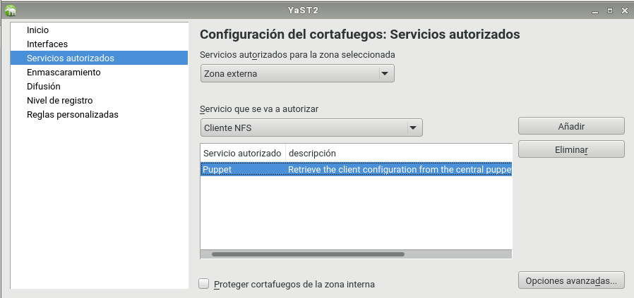

# 1. Introducción a Puppet

Existen varias herramientas para realizar instalaciones desde un punto central, como Chef, Ansible, CFEngine, etc. En este ejemplo, vamos a usar Puppet.

Puppet es una herramienta diseñada para administrar la configuración de sistemas Unix-like y de Microsoft Windows de forma declarativa. El usuario describe los recursos del sistema y sus estados, ya sea utilizando el lenguaje declarativo de Puppet o un DSL (lenguaje específico del dominio) de Ruby.


### 1.2 Preparación

>  * ADVERTENCIA

>   * Los nombres de máquinas, dominios, usuarios, etc., deben estar siempre en minúsculas.
>   * No usar tildes, caracteres especiales (ñ, ü, etc.)
>    * En OpenSUSE podemos hacer configurar el equipo a través de Yast

* Vamos a usar 3 Maquinas virtuales:

    * Master: Dará las órdenes de instalación/configuración a los clientes.
      *  S.O: OpenSUSE.
      *  IP estática: 172.AA.XX.100
      *  Nombre del equipo: masterXX
      *  Dominio: curso1718

        

    * Cliente 1: recibe órdenes del master.
      *  S.O OpenSUSE.
      *  IP estática 172.AA.XX.101
      *  Nombre del equipo: cli1aluXX
      *  Dominio: curso1718

        

    * Client2: recibe órdenes del master.
      *  S.O Windows 7.
      *  IP estática 172.18.XX.102
      *  Nombre Netbios: cli2aluXX
      *  Nombre del equipo: cli2aluXX

        

### 1.3 Configurar /etc/hosts

 Cada MV debe tener configurada en su /etc/hosts al resto de hosts, para poder hacer ping entre ellas usando los nombres largos y cortos. Con este fichero obtenemos resolución de nombres para nuestras propias MV's sin tener un servidor DNS.

  * GNU/Linux

    * El fichero /etc/hosts modificamos las líneas siguientes.

    * Master25

      
    * Cli1alu25

      
  * Windows

    * Localizar el fichero hosts de Windows en la siguiente ruta:

      ``C:\Windows\System32\drivers\etc\hosts``

    * El contenido del fichero hosts de Windows tiene el siguiente aspecto:

      

### 1.4 Comprobar las configuraciones

* En GNU/Linux, para comprobar que las configuraciones son correctas hacemos:

  * date
  * ip a

    

  * route -n
  * host www.google.es
  * hostname -a
  * hostname -f               # Comprobar que devuelve el valor correcto!!!
  * hostname -d               # Comprobar que devuelve el valor correcto!!!

    

  * tail -n 5 /etc/hosts

    

  * ping masterXX
  * ping masterXX.curso1718

    

  * ping cli1aluXX
  * ping cli1aluXX.curso1718

    

  * ping cli2aluXX

    

* En Windows comprobamos con:

  * date
  * ipconfig

    

  * route PRINT

    

  * nslookup www.google.es

    

  * ping masterXX
  * ping masterXX.curso1718

    

  * ping cli1aluXX
  * ping cli1aluXX.curso1718

    

  * ping cli2aluXX

    


### 2. Instalando y configuración del servidor

* Instalamos Puppet Master en la MV master25:`zypper install rubygem-puppet-master`

  

* systemctl enable puppetmaster: Permitir que el servicio se inicie automáticamente en el inicio de la máquina.

  

* systemctl start puppetmaster: Iniciar el servicio.

  

* systemctl status puppetmaster: Consultar el estado del servicio.

  

* En este momento debería haberse creado el directorio /etc/puppet/manifests.

  


### 2.1 Preparamos los ficheros/directorios en el master:

mkdir /etc/puppet/files
touch /etc/puppet/files/readme.txt

  

mkdir /etc/puppet/manifests
touch /etc/puppet/manifests/site.pp

  

mkdir /etc/puppet/manifests/classes
touch /etc/puppet/manifests/classes/hostlinux1.pp

  

### 2.2 Archivo principal de configuración de Nodos "site.pp"

/etc/puppet/manifests/site.pp es el fichero principal de configuración de órdenes para los agentes/nodos puppet.

  * Contenido de nuestro site.pp:

      

### 2.3 Primer archivo hostlinux1.pp

Vamos a crear una primera configuración para máquina estándar GNU/Linux.

  *  Contenido para /etc/puppet/manifests/classes/hostlinux1.pp:

    ```  
      class hostlinux1 {
      package { "tree": ensure => installed }
      package { "traceroute": ensure => installed }
      package { "geany": ensure => installed }
    }
    ```


  *  tree /etc/puppet, consultar los ficheros/directorios que tenemos creado.

  

  *  Comprobar que el directorio /var/lib/puppet tiene usuario/grupo propietario puppet.

  

  *  Reiniciamos el servicio systemctl restart puppetmaster.
  *  Comprobamos que el servicio está en ejecución de forma correcta.
  *  systemctl status puppetmaster

  

  *  netstat -ntap |grep ruby

  

  *  Consultamos log por si hay errores: `tail /var/log/puppet/*.log`

  

  *  Abrir el cortafuegos para el servicio.

  

# 3. Instalación y configuración del cliente1

Vamos a instalar y configurar el cliente 1.

  *  Vamos a la MV cliente 1.

    * Instalar el Agente Puppet `zypper install rubygem-puppet`

      


### 3.1 Definir el host master puppet

Vamos a la ruta ``/etc/puppet`` y modificamos el archivo puppet.conf

  

  *  Comprobar que el directorio /var/lib/puppet tiene como usuario/grupo propietario puppet.

  

  *  systemctl enable puppet: Activar el servicio en cada reinicio de la máquina.

  *  systemctl start puppet: Iniciar el servicio puppet.

  *  systemctl status puppet: Ver el estado del servicio puppet.

  

  *  Abrir el cortafuegos para el servicio.

  

# 4. Certificados

Para que el master acepte a cliente1 como cliente, se deben intercambiar los certificados entre ambas máquinas. Esto sólo hay que hacerlo una vez.


### 4.1 Aceptar certificado

  *  Vamos a la maquina virtual master.
    Nos aseguramos de que somos el usuario root.
    puppet cert list, consultamos las peticiones pendientes de unión al master:

  * Abrimos terminal y ejecutamos `puppet cert list`

      

    > Este es certificado de nuestro cliente 1

  * Y con `puppet cert sign "nombre-máquina-cliente"`

      

    > Añadimos al cliente1 al master

  * Hacemos ahora un `puppet cert print "cliente1"`

      

    > En este caso nos muestra el certificado.

### 4.2 Comprobación

Vamos a comprobar que las órdenes (manifiesto) del master, llega bien al cliente y éste las ejecuta.

  *  Vamos a cliente1:

    * Reiniciamos la máquina y/o el servicio Puppet.

      `systemctl restart puppetmaster.service`

    * Comprobar que los cambios configurados en Puppet se han realizado.

    

    * Ejecutar comando para forzar la ejecución del agente puppet:

    *  puppet agent --test

  

  * En caso de tener errores:

    Consultar el archivo de log del cliente: `tail /var/log/puppet/puppet.log.`

      

### 4.3 Información: ¿Cómo eliminar certificados?

Esto NO HAY QUE HACERLO. Sólo es informativo

Sólo es información, para el caso que tengamos que eliminar los certificados. Cuando tenemos problemas con los certificados, o los identificadores de las máquinas han cambiado suele ser buena idea eliminar los certificados y volverlos a generar con la nueva información.

Si tenemos problemas con los certificados, y queremos eliminar los certificados actuales, podemos hacer lo siguiente:

    En el servidor:
        puppet cert revoke cli1alu42.curso1617, revocar certificado del cliente.
        puppet cert clean cli1alu42.curso1617, eliminar ficheros del certificado del cliente.
        puppet cert print --all, Muestra todos los certificados del servidor. No debe verse el del cliente que queremos eliminar.
    En el cliente:
        rm -rf /var/lib/puppet/ssl, eliminar los certificados del cliente. Apagamos el cliente.


# 5. Segunda versión del fichero pp

Ya hemos probado una configuración sencilla en PuppetMaster. Ahora vamos a pasar a configurar algo más complejo.

  *  Contenido para /etc/puppet/manifests/classes/hostlinux2.pp:

      

  *  Las órdenes anteriores de configuración de recursos puppet, tienen el significado siguiente:

  > IMPORTANTE

  > package: indica paquetes que queremos que estén o no en el sistema.

  >group: creación o eliminación de grupos.

  >user: Creación o eliminación de usuarios.

  >file: directorios o ficheros para crear o descargar desde servidor.

  >exec: Para ejecutar comandos/scripts.

  *  Modificar /etc/puppet/manifests/site.pp para que se use la configuración de hostlinux2 el lugar de la anterior:

  

  *  Vamos al servidor:

    * Ejecutar tree /etc/puppet para comprobar ficheros y directorios.

        

    * Reiniciar el servicio.

      `systemctl restart puppetmaster.service`

  * Vamos al cliente1;

    * Comprobar que se han aplicado los cambios solicitados.

        

        

        

# 6. Cliente puppet Windows

Vamos a configurar Puppet para atender también a clientes Windows.

> IMPORTANTE: Asegurarse de que todas las máquinas tienen la fecha/hora correcta.


### 6.1 Configuración hostwindows3.pp

  * Vamos a la MV master.

    * Vamos a crear una configuración puppet para las máquinas windows, dentro del fichero.

    * Crear/etc/puppet/manifests/classes/hostwindows3.pp, con el siguiente contenido:

      

    * Ahora vamos a modificar el fichero site.pp del master, para que tenga en cuenta la configuración de clientes GNU/Linux y clientes Windows, de modo diferenciado:

      

    *  En el servidor ejecutamos tree /etc/puppet, para confirmar que tenemos los nuevos archivos.

      

    * Reiniciamos el servicio PuppetMaster.

      `systemctl restart puppetmaster.service`

### 6.2 Instalar el cliente2 Windows


Ahora vamos a instalar AgentePuppet en Windows. Recordar que debemos instalar la misma versión en ambos equipos. Podemos usar comando facter para ver la versión de puppet del servidor.

  

  *  Vamos al cliente Windows.

      * Descargamos e instalamos la versión de Agente Puppet para Windows similar al Puppet Master.

      > En nuestro caso usamos la versión 3.8.7

    * El fichero puppet.conf en Windows está en `C:\ProgramData\PuppetLabs\puppet\etc\puppet.conf.`

      

    * Reiniciamos la MV.
    Debemos aceptar el certificado en el master para este nuevo cliente.

    * `puppet cert list`

    

    * `puppet cert sign client 2 `

    

    * `puppet cert print cliente2`

    

    * Comprobamos que esta conectado con el master25

    


# 7. Configuración hostwindows4.pp

  * Configuramos en el master el fichero /etc/puppet/manifests/classes/hostwindows4.pp para el cliente Windows:

    

  * Incluimos en el fichero site.pp

    

  *  Comprobar que funciona.

# 8. Configuración personalizada: hostalumno5.pp

  *  Crear un nuevo fichero de configuración para la máquina cliente Windows con el nombre /etc/puppet/manifests/classes/hostalumno5.pp.

  

  * Incluimos en el fichero site.pp

    
