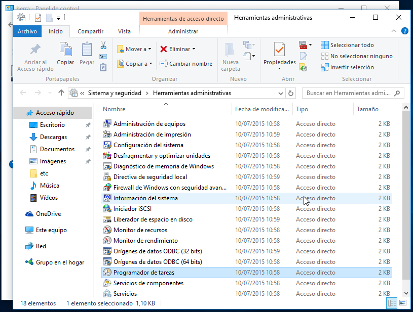
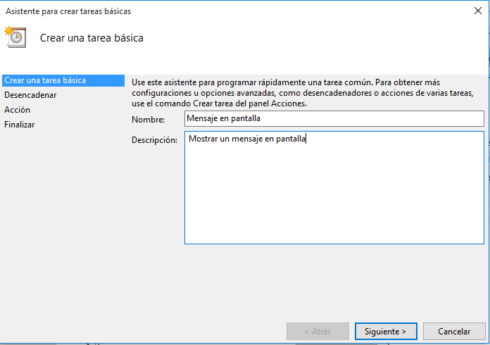
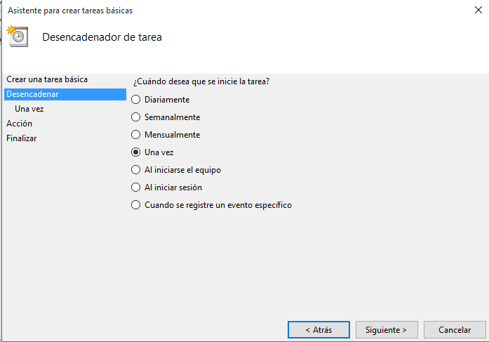
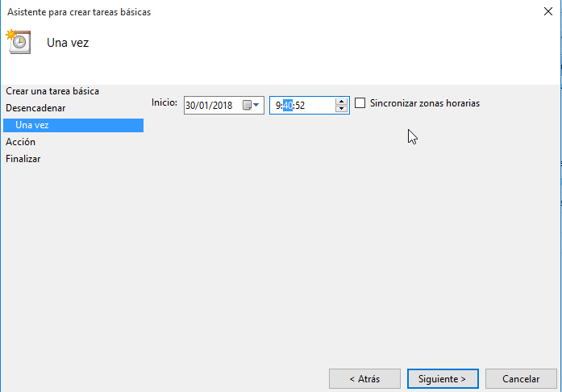
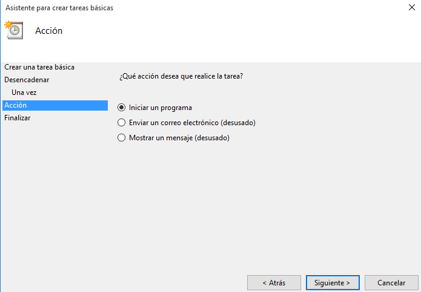
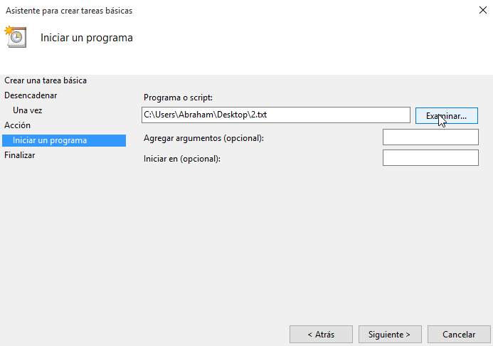
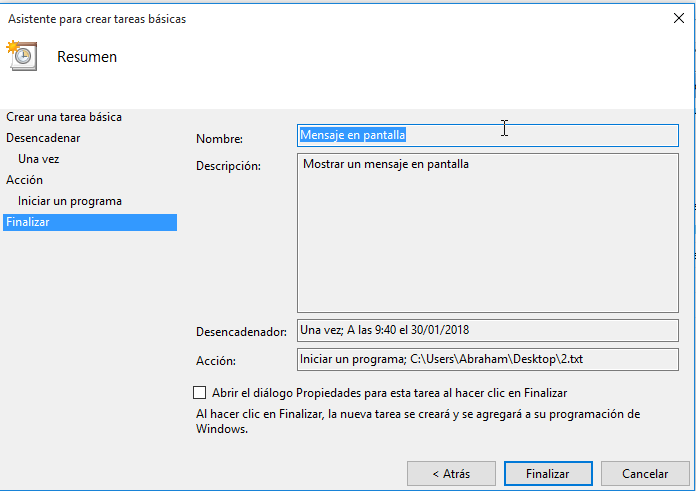
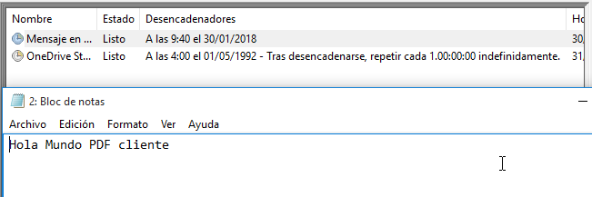
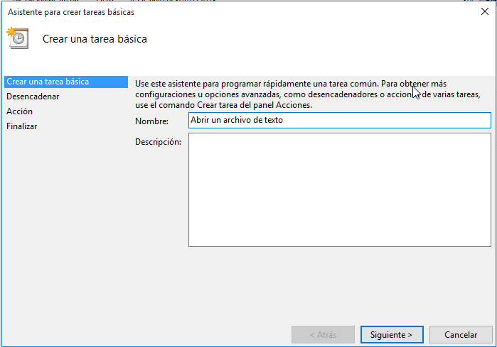

# Tareas programadas

### 1. Windows - Tarea diferida.

Vamos a hacer una tarea diferida con Windows. Una tarea diferida se define para ejecutarse una sola vez en una fecha futura.

  *  En Windows 10 para abrir el programador de tareas hacemos Panel de control -> Herramientas administrativas -> Programador de tareas.

    

  *  Vamos a programar una tarea diferida.

    *  Abrir un fichero de texto en pantalla.

    * Abrimos el Programador de tareas y creamos una nueva tarea.

        

    * Elegimos que se ejecute una vez.

        

    * Elegimos fecha/hora en la que se ejecutara la tarea.

        

    * Seleccionamos Iniciar un programa.

        

    * Buscamos el programa o script

        

    * Finalizamos la tarea.

        

    * Comprobación

        

  *  Iniciar un programa determinado (Firefox).

    * Hacemos los mismos pasos.

      

### 2. Windows - Tarea periódica

La tarea programada se define para ejecutarse periódicamente cada intervalo de tiempo.

    Vamos a programar una tarea periódica para apagar el equipo.
    El comando para apagar el sistema es shutdown. shutdown /?, muestra la ayuda del comando.

### 3. SO GNU/Linux - Tarea diferida

Vamos a hacer una tarea diferida con GNU/Linux.

    Configurar OpenSUSE
    Consultar el vídeo Scheduling tasks with at.

El servicio atd es el responsable de la ejecución de los comandos at. Comprobar que esté en ejecución:

    Yast -> Servicios
    systemctl status atd

    Ejemplos de comandos:

        at, crea una tarea diferida.
        atq, muestra los trabajos en cola.
        at -c 1, muestra la configuración del trabajo ID=1.
        atrm 1, elimina el trabajo con ID=1.

    Otra forma de trabajar con at: at 11:45 Feb 28 < scriptname.sh

    Si el usuario no tuviera permisos para ejecutar at, consultar los ficheros: /etc/at.deny y /etc/at.allow.
    atq, consultamos que no hay ninguna tarea programada.

Ejemplo de script que muestra un mensaje de aviso:

#!/bin/sh
# Mostrar mensaje en pantalla
DISPLAY=:0
export DISPLAY
zenity --info --text="¡Hola nombre-del-alumno!"

    Usar comando at para programar una tarea diferida. Por ejemplo para mostrar un mensaje en pantalla.
    atq, consultamos que SI hay una tarea programada.
    at -c 1, muestra la configuración del trabajo ID=1.
    Capturar imagen cuando se ejecute la tarea.
    atq, consultamos que ya NO hay tareas.

### 4. GNU/Linux - Tarea periódica

Consultar

    Vídeo Scheduling tasks with cron
    Enlaces de interés [Tareas programadas]](https://www.nerion.es/soporte/tutoriales/tareas-programadas-en-linux/)

    Para programar una tarea periódica tenemos dos formas:

        Los usuarios normales usan el comando crontab para programar sus tareas periódicas.
        El usuario root, además puede usar el fichero /etc/crontab para programar las tareas del sistema.

    crontab -l, para consultar que no hay tareas programadas.
    Por defecto, la herramienta crontab usa el editor vim para modificar su configuración. Si queremos usar, por ejemplo, el editor nano, en la consola escribimos export VISUAL='nano'.
    crontab -e, abre el editor para crear una nueva tarea periódica.
    Definir una tarea periódica (crontab) para apagar el equipo todos los días a una hora/minuto determinada.
    Para salir del editor vim, escribimos la secuencia ESC, : y wq.
    crontab -l, para consultar la tarea que tenemos programada.

    Otro script de ejemplo:

        #!/bin/bash
        # Añade la fecha/hora a un fichero cron.log
        date >> /home/usuario/cron.log

    Para definir una tarea ASINCRONA ponemos el script de ejecución en alguno de los directorios siguientes:

        /etc/cron.hourly, cada hora
        /etc/cron.daily, diariamente
        /etc/cron.weekly, semanalmente
        /etc/cron.monthly, mensualmente
